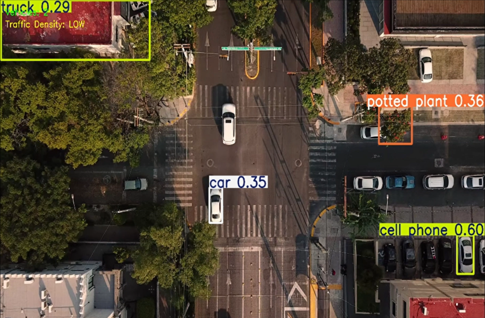

# UAV Traffic Monitoring System

This project demonstrates a computer vision pipeline for traffic monitoring using aerial footage.

The system uses the YOLOv8 object detection model to detect vehicles from drone-style traffic videos and estimate traffic density in real time.

## Features
• Real-time vehicle detection  
• Vehicle counting  
• Traffic density estimation  
• Video processing with OpenCV  

## Technologies Used
- Python
- YOLOv8
- OpenCV
- Computer Vision

## Applications
- Drone traffic monitoring
- Smart city analytics
- Traffic congestion detection# UAV Traffic Monitoring System

This project demonstrates a computer vision pipeline for traffic monitoring using aerial footage.

The system uses the YOLOv8 object detection model to detect vehicles from drone-style traffic videos and estimate traffic density in real time.

## Features
• Real-time vehicle detection  
• Vehicle counting  
• Traffic density estimation  
• Video processing with OpenCV  

## Technologies Used
- Python
- YOLOv8
- OpenCV
- Computer Vision

## Applications
- Drone traffic monitoring
- Smart city analytics
- Traffic congestion detection

## Demo

